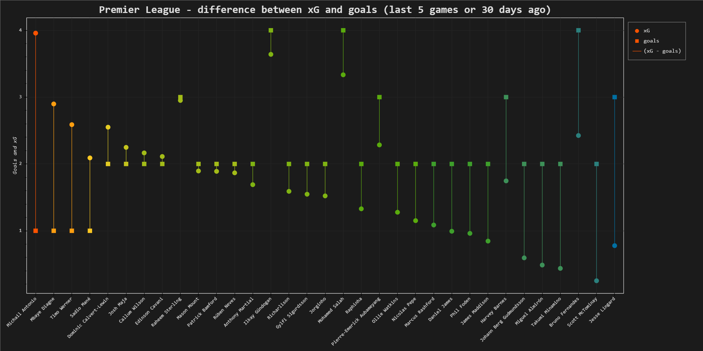

# Data Visualization with Pandas, Bokeh and requests library

## Table of contents

* [About the project](#about-the-project)
* [Technologies](#technologies)

## About the project
### What application do?
This application visualize difference between xG and goals of best players on the plot

  

### How application do it?
* send POST request to [Understat.com](https://understat.com) and gets data from API (requests library)
* converting response to JSON object (requests library)
* conversion data types, calculating difference between xG and goals and sorting data (Pandas)
* visualization data (Bokeh)

## Technologies
Application was built with:
* Python
    * requests library (web scraping data from [Understat.com](https://understat.com))
    * Pandas (data analysis)
    * Bokeh (creating plot and save it to .html file)